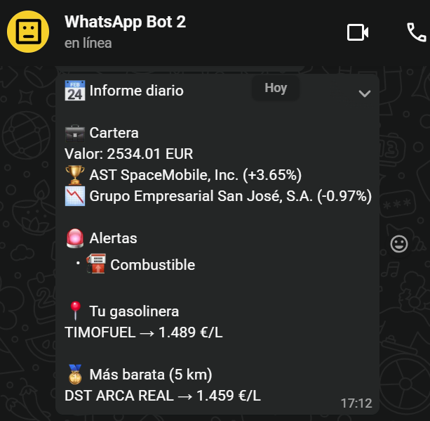

# 📅 Daily Alerts


Daily Alerts is a modular Python application that automatically monitors different information sources and sends a personalized daily report to WhatsApp.

The application is designed to run unattended (GitHub Actions, Task Scheduler, Cron, etc.) while avoiding duplicate notifications through persistent state management.

Its modular architecture makes it easy to add new monitors with minimal changes to the core application.

---

# ✨ Features

## 📈 Investment Portfolio

Monitor stocks and cryptocurrencies.

- Daily portfolio valuation
- Individual asset prices
- Daily performance
- Currency conversion
- Target price alerts
- Stop-loss alerts
- Multi-currency support

Supported providers:

- Yahoo Finance
- CoinGecko
- ExchangeRate API

---

## 📜 BOE Monitor

Monitor publications from the Spanish Official State Gazette.

Examples:

- ADIF
- RENFE
- Guardia Civil
- Policía Nacional
- Public employment
- Custom searches

Features:

- Keyword filtering
- Duplicate detection
- Persistent state

---

## ⛽ Fuel Price Monitor

Monitor fuel prices around a reference station.

Every day the report shows:

- Your reference station
- Cheapest nearby station

Future versions will also notify when prices increase or decrease.

Example:

```text
⛽ Fuel

📍 Your station
LAS PALMERAS
1.489 €/L

🥇 Cheapest nearby (5 km)
DST ARCA REAL
1.459 €/L
```

---

## 📲 Notifications

Notifications are currently sent through WhatsApp using CallMeBot.

The notification system has been designed so additional providers can be added in the future:

- Telegram
- Discord
- Email
- Microsoft Teams
- Slack

---

# 📷 Example Daily Report

```text
📅 Daily Report

💼 Portfolio

Total value: 2,480 €

ASTS        67.58 $
GSJ          8.19 €
BTC     62,824 $

📜 BOE

No new publications.

⛽ Fuel

📍 Your station
LAS PALMERAS
1.489 €/L

🥇 Cheapest nearby (5 km)
DST ARCA REAL
1.459 €/L
```

---

# 📦 Current Monitors

| Monitor | Description |
|---------|-------------|
| Portfolio | Monitors stocks and cryptocurrencies with configurable alerts. |
| BOE | Searches the Spanish Official State Gazette using configurable searches and keywords. |
| Fuel | Compares your reference station against the cheapest nearby station. |

---

# 📁 Project Structure

```
daily-alerts/
│
├── .github/
│   └── workflows/
│       └── daily-alerts.yml
│
├── cache/
│   └── fuel_stations.json          # Local development only
│
├── config/
│   ├── config.example.json
│   └── config.json                 # Local only (ignored by Git)
│
├── core/
│   ├── analyzer.py
│   ├── notifier.py
│   ├── report.py
│   └── state.py
│
├── monitors/
│   ├── boe.py
│   ├── fuel.py
│   └── portfolio.py
│
├── providers/
│   ├── boe.py
│   ├── currency.py
│   ├── fuel.py
│   ├── stocks.py
│   └── crypto.py
│
├── scripts/
│
├── state/
│
├── tools/
│   └── configure_fuel.py
│
├── .env.example
├── .env                            # Local only (ignored by Git)
├── main.py
├── requirements.txt
├── README.md
└── LICENSE
```

---

# 🚀 Installation

Clone the repository.

```bash
git clone git@github.com:YOUR_USERNAME/daily-alerts.git

cd daily-alerts
```

Create a virtual environment.

Windows

```bash
python -m venv .venv

.venv\Scripts\activate
```

Linux/macOS

```bash
python -m venv .venv

source .venv/bin/activate
```

Install all dependencies.

```bash
pip install -r requirements.txt
```

---

# ⚙️ Local Configuration

Copy the example configuration files.

Linux/macOS

```bash
cp config/config.example.json config/config.json
cp .env.example .env
```

Windows (PowerShell)

```powershell
Copy-Item config\config.example.json config\config.json
Copy-Item .env.example .env
```

Edit both files with your own settings.

---

## `.env`

```text
PHONE=346XXXXXXXX
APIKEY=YOUR_CALLMEBOT_API_KEY
```

These credentials are provided by **CallMeBot** and are used to send WhatsApp notifications.

This file is intentionally ignored by Git.

---

## `config.json`

This file contains the application configuration.

Configure:

- General settings
- Investment portfolio
- BOE searches
- Fuel monitor
- Alert thresholds

Example:

```json
{
  "settings": {
    "base_currency": "EUR",
    "language": "es"
  },

  "portfolio": {
    ...
  },

  "monitors": {
    "portfolio": {
      "enabled": true
    },

    "boe": {
      "enabled": true
    },

    "fuel": {
      "enabled": true
    }
  }
}
```

This file contains personal information and **must never be committed**.

For GitHub Actions, its contents are stored in the repository secret:

```
CONFIG_JSON
```

---

# ⛽ Fuel Monitor Configuration

The first time you use the fuel monitor you must select your reference station.

Run:

```bash
python -m tools.configure_fuel
```

Example:

```text
============================================================
               Fuel Station Finder
============================================================

Search (empty to exit): parquesol valladolid
```

The tool will search all stations and display the best matches.

Example:

```text
[1] REPSOL PARQUESOL
    ID       : 15212
    Address  : Calle Francisco Umbral, 3
    City     : Valladolid
    Price    : 1.489 €/L
```

Select the desired station.

The configuration file will be updated automatically.

Example:

```json
"fuel": {
    "enabled": true,
    "reference_station": {
        "id": 15212
    },
    "radius_km": 5,
    "fuel_type": "gasoleo_a"
}
```

Only the station ID is stored.

The station name is always retrieved from the official API, ensuring that any future name changes are reflected automatically.

---

# 🛠 Local Fuel Cache

Some Windows environments are unable to establish an HTTPS connection with the official Ministry API from Python, despite working correctly from browsers and GitHub Actions.

To simplify local development, Daily Alerts supports using a local cache.

Generate it with:

```bash
curl "https://sedeaplicaciones.minetur.gob.es/ServiciosRESTCarburantes/PreciosCarburantes/EstacionesTerrestres/" -o cache/fuel_stations.json
```

The cache file is used **only during local development**.

GitHub Actions always downloads live data from the official API.

The cache file is intentionally excluded from Git.

---

# ▶️ Running Locally

Execute:

```bash
python main.py
```

If everything is configured correctly, you will receive a WhatsApp message including:

- 📈 Portfolio summary
- 📜 BOE updates
- ⛽ Reference fuel station price
- 🥇 Cheapest nearby station

---

# 🤖 GitHub Actions

The application can run automatically every day using GitHub Actions.

Required repository secrets:

| Secret | Description |
|---------|-------------|
| PHONE | Destination phone number |
| APIKEY | CallMeBot API key |
| CONFIG_JSON | Full contents of `config.json` |

During execution the workflow automatically recreates:

```
config/config.json
```

before launching the application.

No sensitive information is stored in the repository.

---

## External Data Sources

Daily Alerts retrieves information from the following public services:

| Service | Purpose |
|---------|---------|
| Yahoo Finance | Stock prices |
| CoinGecko | Cryptocurrency prices |
| ExchangeRate API | Currency conversion |
| BOE | Official Spanish State Gazette |
| Spanish Ministry Fuel API | Fuel prices |
| CallMeBot | WhatsApp notifications |

---

# 🏗 Architecture

Daily Alerts follows a modular architecture where each monitor is completely independent.

```
                              main.py
                                  │
        ┌─────────────────────────┼─────────────────────────┐
        │                         │                         │
        ▼                         ▼                         ▼
   Portfolio Monitor         BOE Monitor             Fuel Monitor
        │                         │                         │
        ▼                         ▼                         ▼
 Yahoo Finance API            BOE Provider        Fuel Prices Provider
 CoinGecko API
 ExchangeRate API
        │                         │                         │
        └───────────────┬─────────┴───────────────┬─────────┘
                        ▼                         ▼
                  State Management         Report Generator
                             │
                             ▼
                      WhatsApp Notification
```

The application is intentionally designed so new monitors can be added without modifying the existing ones.

Each monitor is responsible for:

- Retrieving data.
- Detecting relevant changes.
- Returning standardized results.
- Leaving report generation to the core application.

---

# 🛠 Technologies

## Language

- Python 3.13

## Libraries

- requests
- beautifulsoup4
- yfinance
- python-dotenv

## APIs

- Yahoo Finance
- CoinGecko
- ExchangeRate API
- BOE
- Spanish Ministry Fuel API
- CallMeBot

---

# 💾 Persistent State

To prevent duplicate notifications, Daily Alerts stores the last execution state.

Examples:

- Previously detected BOE publications.
- Last fuel prices.
- Future monitors.

The state is stored in:

```
state/state.json
```

This allows the application to notify **only when something changes**.

---

# ➕ Adding a New Monitor

Adding a new monitor is straightforward.

Create:

```
providers/my_provider.py
```

to retrieve the data.

Then create:

```
monitors/my_monitor.py
```

Finally, register it in:

```
main.py
```

No additional changes to the application are required.

---

# 🗺 Roadmap

## Planned Features

### Portfolio

- Historical performance
- Portfolio allocation
- Profit/Loss calculation
- Dividend tracking
- ETF support

### Fuel

- Price increase alerts
- Price decrease alerts
- Weekly price evolution
- Monthly statistics

### BOE

- More configurable searches
- Multiple keyword groups
- Publication categories

### New Monitors

- 🌦 Weather forecast
- ⚡ Electricity price
- 💱 EUR/USD exchange rate
- 🚆 Renfe incidents
- 📦 Package tracking
- 📰 Economic news
- 📅 Calendar reminders

### Notifications

- Telegram
- Discord
- Email
- Slack
- Microsoft Teams

### General

- Docker support
- Unit tests
- Plugin system
- Web dashboard
- REST API

---

# 🤝 Contributing

Contributions are welcome.

If you have an idea for a new monitor or improvement:

1. Fork the repository.
2. Create a feature branch.
3. Commit your changes.
4. Open a Pull Request.

Bug reports and feature requests are also appreciated.

---

# 🔒 Security

Please do **not** include:

- `.env`
- `config/config.json`
- `state/state.json`
- Personal API keys
- Phone numbers

when opening issues or pull requests.

Sensitive configuration should always be stored using environment variables or GitHub Secrets.

---

# 📄 License

This project is licensed under the **MIT License**.

See the `LICENSE` file for details.

---

# ⭐ Acknowledgements

This project makes use of several excellent public services and open APIs.

Special thanks to:

- Yahoo Finance
- CoinGecko
- Agencia Estatal Boletín Oficial del Estado (BOE)
- Ministerio para la Transición Ecológica y el Reto Demográfico
- CallMeBot

---

Made with ❤️ using Python.